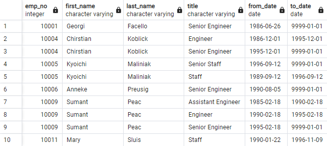
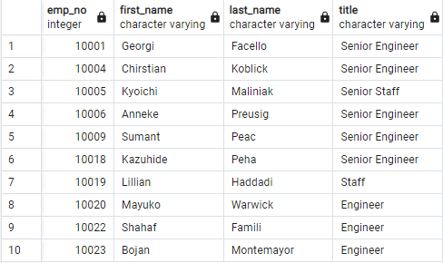
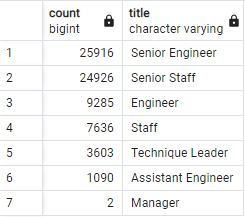
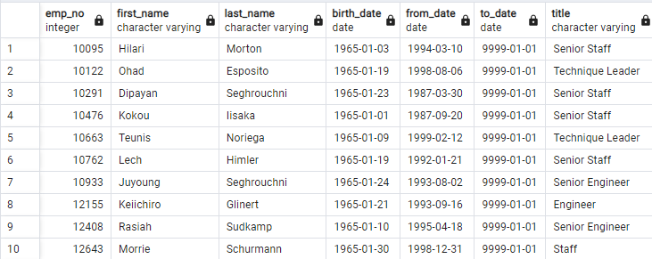

# Pewlett-Hackard-Analysis

## Overview of Pewlett-Hackard-Analysis:
#### Bobby's manager has tasked us with finding out the number of retiring employees per title, and to create a list of employees that are eligible to participate in a mentorship program. This will provide the company with greater insight into how to handle the mass exodus of senior employees also known as the "silver tsunami."

## Pewlett-Hackard-Analysis Results
###  <u>The Number of Retiring Employees by Title:</u>
 
 * In order to figure out the number of retiring employees by title, we need to first merge the employees table with the titles table. Before we do so, however, we need to make sure to filter the merged table for employees born between 1952 and 1955. This will allow us to see all employees that are about to retire. 
 See below: 
    
 

* Unfortunately, the table is showing us duplicate entries, due to employees switching job titles over the years. This can easily be fixed by using the distinct on statement in postgres. 
First, we will exclude all employees that are not working for the company, and second, we will create a new table that only contains unique titles. By doing so, we will only show current employees with their latest job titles. Here is the new unique_titles table: 

  
* All that is left, is to create a new table that will count and group employees by their title. The result can be seen in the following table: 

###  <u>The Employees Eligible for the Mentorship Program:</u>
* To find all the eligible employees for the mentorship program, we create a new table that merges the department employees table with the employees and title table. Then, we filter the table for current employees only while making sure that their employee number is unique. Lastly, we find all employees that were born between January 1, 1965 and December 31, 1965. Doing so will return us with all the employees that are eligible for the mentorship program. 

## Pewlett-Hackard-Analysis Summary:

To summarize the 4 major points from our analysis above:
*  First, we create a table showing us all retiring employees. 
* Second, we filter the table for any duplicate entries. 
* Third, we created a table that counted the number of retiring employees by title. 
* And lastly, we created a table that showed all the employees that are eligible for the mentorship program.

<u>How many roles will need to be filled as the "silver tsunami" begins to make an impact?</u>
* 72,458 is the number of senior roles that will need to be filled.
    </u>  

<u>Are there enough qualified, retirement-ready employees in the departments to mentor the next generation of Pewlett Hackard employees?</u>

* Unfortunately, there are only 1,549 employees that are eligible for the mentorship program.
      

It is clear from the data that Pewlett Hackard will face a great challenge with the "silver tsunami." There are simply not enough employees left to fill in every senior position within the company. Pewlett Hackard needs to immediately do the following:
1. Find the total amount of salaries per retirement-ready employee. This will give the company better insight into how to reallocate these resources once the "silver tsunami" hits. How much would it cost to hire new senior/experienced staff?
2. In our previous analysis, not every department had a manager. Find out why this is the case. Does the company need to fill in every single position, or is this not the case anymore?
3. Our search query limited the amount of people eligible for the mentorship program to employees born between January 1, 1965 and December 31, 1965. This query could be expanded to employees born between 1960 to 1965.
